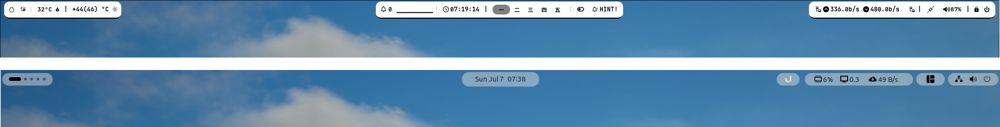

### Anubar

The waybar inspired a drop-in replacement topbar for personal use. It quickly elevates the fresh ubuntu installation to the developer ready machine with useful shortcuts, extensions and apps. The script only **tested** in Ubuntu 24.04 new install alone.

Except the hyprland exceptional tiling, this one stop script adjusts the default Ubuntu to mimic `hyprland` + `waybar` combinations under Gnome + Wayland.



#### Getting started

```
git clone https://github.com/im-ng/anubar.git
cd anubar
chmod +x install.sh
./install.sh
```

#### Clean up

```
cd anubar
chmod +x uninstall.sh
./uninstall.sh
```

### Keyboard shortcuts

Shortcuts inspired from hyprland.

| Keymap            | Action                       |
| ----------------- | ---------------------------- |
| Super + D         | Launch ulauncher             |
| Super + Enter     | Launch terminal              |
| Super + Q         | Kill active window           |
| Super + F         | Full / Restore window size   |
| Super + L         | Lockscreen                   |
| Super + Shift + L | Logout                       |
| Super + H         | Hide                         |
| Super + Shift + H | Hide / Restore active window |

#### Audio

| Keymap                    | Action          |
| ------------------------- | --------------- |
| Ctrl + Super + Down Arrow | Reduce Volume   |
| Ctrl + Super + Up Arrow   | Increase Volume |

#### Settings

| Keymap            | Action          |
| ----------------- | --------------- |
| Super + S         | Topbar Settings |
| Super + Shift + S | Settings        |

#### Workspaces

| Keymap                           | Action                          |
| -------------------------------- | ------------------------------- |
| Super + 1                        | First workspace                 |
| Super + 2                        | Second workspace                |
| Super + 3                        | Third workspace                 |
| Super + 4                        | Fourth workspace                |
| Super + 5                        | Fifth workspace                 |
| Super + 0                        | Last workspace                  |
| Super + Shift + Left/Right Arrow | Move across workspaces          |
| Super + Mouse scroll             | Move across workspaces          |
| Super + Shift + workspace-number | Move active window to workspace |

#### Window

| Keymap                                                | Action |
| --------------------------------------------------- | ---------- 
| Super + Left Arrow | Resize half and move left |
| Super + Right Arrow | Resize half and move right |
| Super + Down Arrow | Resize full |

#### Terminal

| Keymap                                                | Action |
| --------------------------------------------------- | ---------- 
| Super + Enter | Launch Terminal |

### Extensions & Apps

- Openbar: an opinionated topbar custimizable gnome extensions
- AppIndicator: Tray icons support to the Shell
- Vitals: An handy extension to preview system resource usages
- Tiling Shell: Extend Gnome Shell with advanced tiling window management. 
- Ulauncher: Application launcher for Linux 

### License

[MIT License](https://opensource.org/license/MIT)